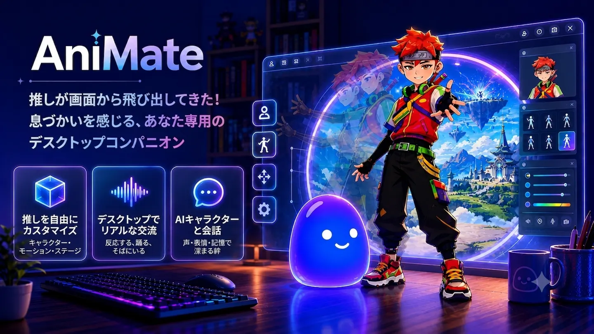

# AniMate Waifu

**あなたのキャラクターを、デスクトップで生き生きと。自分の VRM 0.x / 1.0 モデルを置いて、テキストや音声で話しかければ、応えながら身体が動き、音楽に合わせて踊ります。**

*好きなキャラクターが、本当にそばにいてくれたら——*

Windows & macOS で無料で開始 · 買い切り、サブスクなし

[公式サイト](https://getanimate.app/) · [ダウンロード](https://getanimate.app/download) · [Microsoft Store](https://apps.microsoft.com/detail/9PHRL2T3F0BS)

[English](README.md) · [简体中文](README_zh-CN.md) · **日本語**

---

## 概要

AniMate Waifu は、3D アニメのキャラクターを Windows / Mac のデスクトップに置くアプリです。透過・常に最前面のコンパニオンがカーソルを追い、触ると反応し、音楽に合わせて踊り、テキストや音声で会話します。

壁紙でも、ブラウザのチャットタブでもありません。キャラクターはウィンドウの手前、あなたの作業中のデスクトップに住みます。

**このリポジトリは AniMate Waifu の公式ホームです。** アプリ自体はクローズドソースです。バグ報告・機能要望・質問は [Issues](../../issues) へどうぞ。すべて目を通しています。

## ハイライト

- **あなたのアニメキャラクターを、生き生きと** — VRoid Studio で作った模型、commission した模型、ダウンロードした模型など、任意の VRM モデルをインポート
- **隅のチャットボットではなく、AI コンパニオン** — AI のテキスト・音声チャット、全二重と割り込みに対応、**記憶あり**。話しながら身体が動く
- **1 つのダンスを全キャラで** — VRMA ダンスファイルをインポートし、ライブラリ内のどのキャラにも適用可能
- **設定パネルではなくライブラリ** — ワークショップでキャラ・モーション・ダンス・ステージを 3D プレビュー付きで一元管理
- **Windows と Mac の両方で使えます** — 配布方法が異なります（Microsoft Store / 公式サイト）
- **買い切り** — US$9.90 の一回払いでフル機能解放。サブスクなし、14 日間返金

## こんな人に

- **「好きなアニメキャラをデスクトップに置きたい」** — そのキャラの VRM モデルをインポートすれば、作業中もそばにいてくれます
- **「本当に会話できる AI コンパニオンがほしい」** — テキストや音声での本物の会話。身体・表情・声で応えます
- **「自分で作った VRoid キャラを動かしたい」** — VRoid Studio で作ったモデルがそのまま主役になります
- **「VRM モデルを自作・依頼・収集している」** — キャラクターライブラリを一元管理し、ダンスやステージを全キャラで再利用

## 機能

### キャラクター：VRM インポートと VRoid Studio
- **VRM 0.x / VRM 1.0 両方に対応**（Pro）。最新の VRoid Studio の出力も含む。MToon / MToon10 シェーダー対応
- VRoid Studio モデルのスムーズなワークフロー
- キャラクターライブラリ：インポートした模型をすべて一元管理
- キャラごとに人格・声・コンパニオンスタイルを設定可能
- 内蔵キャラクター 2 体を無料で同梱

### デスクトップでの存在感
- 透過・常に最前面のオーバーレイ——キャラはウィンドウではなくデスクトップに立つ
- クリックスルー対応——操作の邪魔をしない
- 位置・サイズはセッション間で記憶
- システムトレイアイコンと起動時自動スタート
- UI は 8 言語対応：日本語、English、简体中文、한국어、Français、Deutsch、Español、Português

### インタラクション
- カーソル追跡——視線と頭がマウスを追う
- 頭を撫でる・ドラッグ・リサイズに反応
- 右クリックメニューでクイック操作
- 自然なアイドルモーションがランダムに切り替わり、同じクリップをループしない
- スリープモード——キャラは眠くなって休む
- ちびモード——キャラをコンパクトに縮小
- 性格プリセットとインタラクション強度を調整可能：穏やかにも活発にも、あなた次第

### ダンスと音楽
- 音楽反応——かかっている曲に合わせて動く
- 無料版にも内蔵ダンスを同梱
- **VRMA ダンスインポート**（Pro）— 自分の持っているダンスファイルを持ち込める
- **1 つのダンスをどのキャラでも** — ダンスは 1 体のモデルに固定されない。ライブラリ内の全キャラに適用可能

### ワークショップ
- キャラ・モーション・ダンス・ステージを 1 ヶ所で管理
- 回転・ズーム付き 3D プレビュー
- ステージのインポートと切替（Pro）——画像・動画を背景に、キャラは壁紙の上ではなくシーンの中で踊る

### AI コンパニオンと会話
- テキスト・音声チャットがキャラ本体を動かす——隅のチャットボットではなく、そのキャラ自身が話す
- 音声は全二重：キャラが話している間も話せて、途中で割り込める
- **記憶**——話した内容を覚えており、会話は毎回リセットされず続きから
- **ワールドブック**——独自の設定・背景・キャラ知識を読み込ませ、返答をキャラのまま保つ
- キャラごとのカスタム TTS 音声——聞き覚えのある声で応答
- リップシンク・表情・字幕が会話に合わせて変化
- 人格とコンパニオンスタイルはキャラごとに設定
- チャット履歴は自分のデバイスに保存
- チャットにはインターネット接続と、対応する AI / 音声サービスの設定が必要

### パフォーマンスと信頼
- 管理者権限不要、ドライバ不インストール、保護されたシステムファイルの変更なし
- サードパーティ製ソフトの同梱なし
- 配布は Microsoft Store（署名付き）と公式サイトのダイレクトインストーラー（SHA256 チェックサム公開）のみ

### Windows / macOS のデスクトップペット
- Windows 10/11（64 ビット）— Microsoft Store またはダイレクトインストーラー
- macOS 12 以降（Apple Silicon）— 公式サイトからダウンロード

## 無料版と Pro

| | 無料版 | Pro（US$9.90 買い切り） |
| --- | --- | --- |
| 内蔵キャラクター | 2 体 | 2 体 + インポートした全キャラ |
| インタラクション（カーソル追跡・なでなで・ドラッグ・アイドル） | ✅ | ✅ |
| 音楽反応 + 内蔵ダンス | ✅ | ✅ |
| AI チャット（テキスト・音声） | ✅ | ✅ |
| カスタム VRM インポート（0.x + 1.0） | — | ✅ |
| モーション / VRMA ダンスインポート | — | ✅ |
| カスタムステージ | — | ✅ |
| ワークショップ管理 | — | ✅ |
| 返金 | — | 14 日間 |

1 回の支払いで、作り上げたライブラリ全体が対象。キャラごとでも年ごとでもありません。

## インストール

1. **入手** — [Microsoft Store](https://apps.microsoft.com/detail/9PHRL2T3F0BS)（Windows 推奨）または[公式インストーラー](https://getanimate.app/download)。
2. **場所を決める** — 好きな場所に置けば、次回起動時もそこにいます。
3. **キャラを連れて帰る** — アプリ内で `.vrm` ファイルをインポート。[VRM インポートガイド](https://getanimate.app/guides/import-vrm-model)参照。モデルをお持ちでなければ[コミュニティの無料モデルライブラリ](https://getanimate.app/models)へ。モデルはコミュニティ製で、ライセンスは個別に異なります。

## 安全ですか？

配布は Microsoft Store と公式サイトのインストーラーのみです。サードパーティ製ソフトの同梱なし、管理者権限不要、全リリースに検証可能な SHA256 チェックサムを公開しています。

## 比較

第一列は自社製品；他社の情報は公開資料より確認（2026 年 8 月）。`—` は公開資料でその機能を確認できなかったという意味で、非対応の断定ではありません。

| | AniMate Waifu | MateEngine | Desktop Mate |
| --- | --- | --- | --- |
| プラットフォーム | Windows 10/11 · macOS（Apple Silicon） | Windows のみ | Windows 10/11 · macOS beta |
| モデル形式 | **VRM 0.x + 1.0** | VRM 0.x（1.0 は「近日対応」） | 公式ライセンスキャラ；カスタム VRM は開発中 |
| キャラクター | 内蔵 2 体 + **自分の VRM** | 自分の VRM | 公式ライセンス DLC（キャラごと） |
| テキスト会話 | ✅ | ✅ 小型ローカルモデル | — ボイスラインのみ |
| 音声会話 | ✅ 全二重 | — | — |
| 割り込み | ✅ 話している最中でも話せる | — | — |
| 記憶 | ✅ 過去の会話を記憶 | — | — |
| ワールドブック / 独自設定 | ✅ | — | — |
| 音声 | ✅ キャラごとのカスタム TTS | — | 固定のキャラボイス |
| ダンス | 音楽反応 + **VRMA インポート、全キャラ適用** | 音楽反応（実験的） | — |
| ステージ / 背景 | 画像・動画ステージ | — | — |
| 資産管理 | ワークショップ（3D プレビュー） | Mod SDK | — |
| 価格 | 無料版 + **US$9.90 買い切り** | 無料（オープンソース） | 無料ベース + キャラごとの DLC |
| オープンソース | いいえ（クローズドソース；本リポジトリはホーム兼 Issues） | はい（AGPL-3.0） | いいえ |

### AI コンパニオン機能の内訳

「会話できる」は機能表では 1 行に潰されがちなので、ここで分解します：

- **テキスト + 音声** — 入力でも発話でも、返答はそのキャラ自身の声で
- **音声は全二重** — キャラが話している間もこちらから話せる。順番待ちは不要
- **割り込み対応** — 途中で話しかければ、台本を読み切らずに止まって応答
- **記憶** — 話した内容を覚えており、会話は毎回リセットされず続きから
- **ワールドブック / 独自設定** — 設定・背景・キャラ知識を読み込ませ、返答をキャラのまま保つ（AI ロールプレイツールと同じ "world book" 形式）
- **音色のカスタマイズ** — キャラごとに TTS 音声を設定。2 体が同じ声になることはありません
- **返答に身体が追従** — リップシンク・表情・モーションが会話によってリアルタイムに駆動され、別ループのアニメーションではありません

それぞれ得意分野があります：ソースを読んで Mod したいなら MateEngine、公式ライセンスキャラなら Desktop Mate、ローカル LLM + 画面認識 + 自発的な話しかけ + 声のクローンなら AI Desktop Pet が AI 面で私たちより踏み込んでいます。AniMate Waifu は**自分のキャラクターと本物の会話**のために作られています。詳細比較：[AniMate Waifu vs Desktop Mate](https://getanimate.app/desktop-mate-alternative)

## 正直な境界線

誇大広告よりインストールを諦める方がいい：

- **PMX / FBX のネイティブインポートは非対応** — 先に VRM へ変換を（[ガイド](https://getanimate.app/guides/import-vrm-model)）
- **チャットには要インターネット** — オフラインのローカル LLM モードはなく、画面認識や自発的な話しかけもありません

## FAQ

**無料ですか？** 無料です（制限あり）：内蔵 2 体、フルインタラクション、AI チャット、デスクトップダンスは時間制限なしで無料。Pro は買い切りです。

**対応する VRM バージョンは？** VRM 0.x と VRM 1.0 の両方。最新の VRoid Studio の出力も含みます。PMX / FBX は要先変換です。

**モデルはどこで？** [VRoid Studio](https://vroid.com/studio)（無料）で自分で作るか、[コミュニティの無料モデルライブラリ](https://getanimate.app/models)をどうぞ。コミュニティ製のため、ライセンスは各モデルごとに確認してください。

**AI チャットのデータはどこへ？** チャットはクラウド接続でインターネットが必要です。チャット履歴は自分のデバイスにローカル保存されます。

**過去の会話を覚えていますか？** はい。記憶によりセッションをまたいで文脈が保たれ、ワールドブックを読み込ませれば設定や背景も一貫します。

**UI の対応言語は？** 日本語、English、简体中文、한국어、Français、Deutsch、Español、Português の 8 言語。いつでも切替可能。

**モデルの権利を尊重してください。** 権利を持っているキャラクターだけを使用し、ライセンスが再配布を許可していない模型の転載はしないでください。

## ライセンス

アプリはプロプライエタリです（[LICENSE](LICENSE) 参照）。VRM はオープンなアバターファイル形式です。「VRoid」は Pixiv Inc. の商標です。本プロジェクトは Pixiv、Valve、その他の IP 権利者とは関係ありません。
